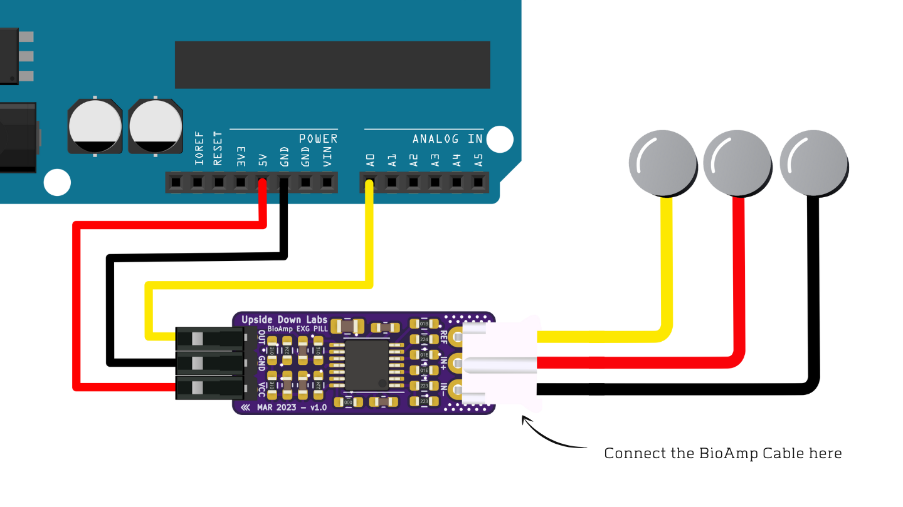
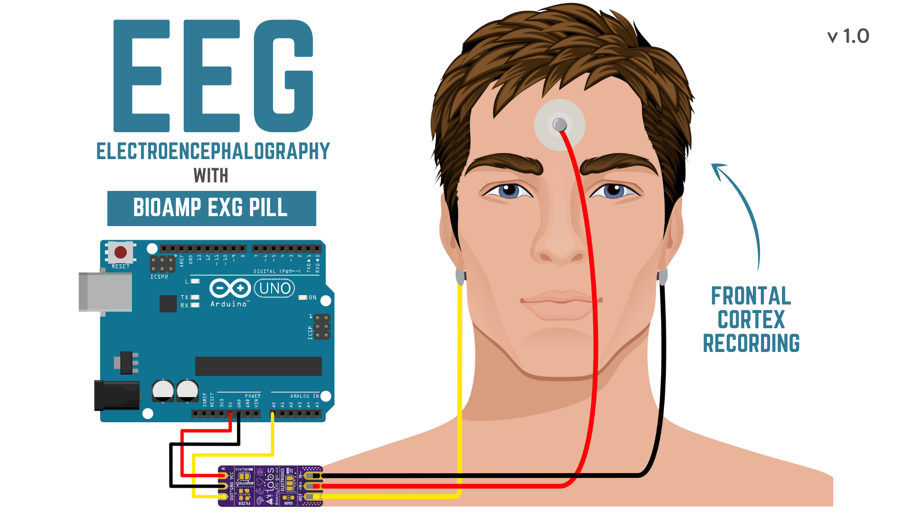
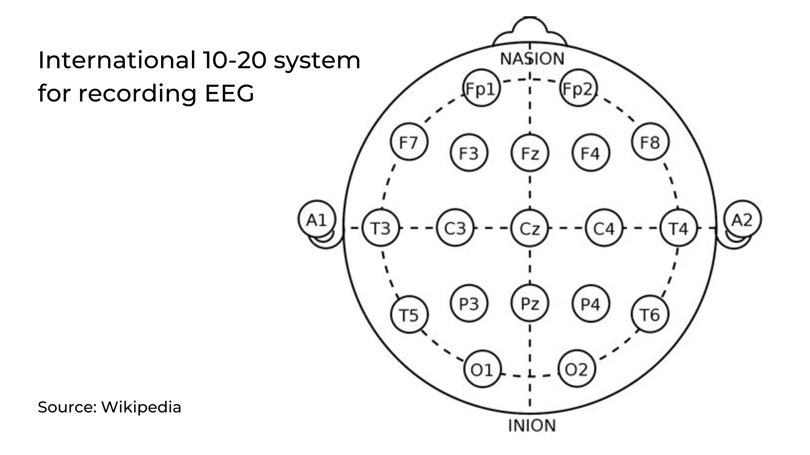

# Mind-Nav — Brain-Controlled Navigation via EEG

> Control your computer with your mind. Mind-Nav is a full-stack Brain-Computer Interface (BCI) system that captures raw EEG brainwaves, trains machine-learning and deep-learning models to detect mental intent, and translates that intent into real-time navigation actions.

---

## Project Structure

```
Mind-Nav/
├── Data/                   # Raw and processed EEG recordings (CSV)
├── EEG_Recorder/           # C++ application to capture live EEG data from hardware
├── Mind-Nav-App/           # Python application — real-time BCI navigation controller
└── Notebook/               # Jupyter notebooks — ML/DL model training & evaluation
    └── BCI_Notebook_Deep_Learning.ipynb
```

---

## Overview

Mind-Nav is an end-to-end BCI pipeline built around two mental states:

| Intent | Label | Description |
|---|---|---|
| **REST** | `0` | Relaxed, no action intended |
| **CLICK** | `5` | Active mental intent to click/interact |

EEG signals are captured at **256 Hz**, cleaned, segmented into trials, and fed into four trained classifiers. The best model is then deployed inside the navigation app to issue real-time computer commands purely from brainwave data.

---

## Components

### 1. `EEG_Recorder/` — Hardware Signal Capture (C++)

A C++ application that interfaces directly with an EEG headset to record raw brain signals. It streams or saves timestamped EEG samples (in millivolt readings) alongside intent labels to a CSV file, which serves as the training dataset for all downstream models.

**Output format:**

| Column | Description |
|---|---|
| `Timestamp_Unix` | Unix epoch timestamp |
| `Signal_mV` | Raw EEG amplitude in mV (baseline ~500 mV) |
| `Intent_Label` | Human-readable label: `REST` or `CLICK` |
| `Label_Class` | Numeric label: `0` (REST) or `5` (CLICK) |

---

### 2. `Data/` — EEG Dataset

Contains the recorded EEG CSV file (`eeg_precision_bci.csv`) used for training and evaluation.

**Dataset statistics:**

| Property | Value |
|---|---|
| Sampling rate | 256 Hz |
| Total samples (trimmed) | 72,589 |
| Total duration | ~283.6 seconds |
| REST samples | 28,658 |
| CLICK samples | 43,931 |

The first 500 samples (≈ 2 seconds) are discarded during preprocessing to remove headset initialisation noise.

---

### 3. `Notebook/` — Model Training & Evaluation

The core ML pipeline, documented step-by-step in a Jupyter notebook.

#### Pipeline Steps

**Data Loading & Preprocessing**
- Load `eeg_precision_bci.csv` and trim initialisation noise
- Zero-centre the signal by subtracting the 500 mV baseline offset
- Inspect class distribution and recording duration

**EEG Visualisation**
- Plot the first 30 seconds of the EEG waveform with a per-class colour overlay
- Visualise the label track alongside the raw signal

**Trial Segmentation**
- Detect label transitions to split the continuous stream into discrete trials
- Each contiguous run of the same label becomes one segmented trial

**Feature Engineering — 42 Features per Trial**

Features are extracted per trial across three groups:

- **Time-domain:** Mean, std, variance, peak-to-peak, RMS, skewness, kurtosis, zero-crossing rate, mean absolute value
- **Frequency-domain (Welch PSD):** Absolute and relative band power for Delta (0.5–4 Hz), Theta (4–8 Hz), Alpha (8–13 Hz), Beta (13–30 Hz), and Gamma (30–100 Hz); spectral entropy; peak frequency; spectral centroid
- **Cross-band ratios:** Alpha/Beta, Theta/Alpha, and other clinically motivated power ratios

**Band Power Visualisation**
- Side-by-side distribution plots for each EEG band across REST vs CLICK

#### Models Trained

Four models are trained and compared using **5-fold Stratified Cross-Validation**:

| # | Model | Input | Architecture |
|---|---|---|---|
| 1 | **ET + RF Ensemble** (scikit-learn) | 42 features | Soft-voting: ExtraTreesClassifier + RandomForestClassifier (500 trees each, balanced class weights) |
| 2 | **FNN** (PyTorch) | 42 features | 3× `Linear → BatchNorm → ReLU → Dropout(0.4)` → classifier |
| 3 | **CNN** (PyTorch) | Raw EEG window (256 samples) | 3× `Conv1D → BatchNorm → ReLU → MaxPool → Dropout` → GlobalAvgPool → Linear |
| 4 | **Hybrid CNN + FNN** (PyTorch) | Raw window + 42 features | Dual-branch: CNN (→128-d) + FNN (→64-d) fused (192-d → MLP → 2 classes) |

All PyTorch models use the Adam optimiser with a cosine annealing learning-rate schedule and cross-entropy loss.

**Model Comparison**
- A bar chart displays the mean ± std 5-fold CV accuracy for all four models side by side

#### Saved Artefacts

| File | Contents |
|---|---|
| `BCI_MODEL.joblib` | Sklearn ET+RF ensemble (fitted on full dataset) |
| `BCI_SCALER.joblib` | `StandardScaler` for the 42-feature matrix |
| `BCI_FNN.pt` | PyTorch FNN weights |
| `BCI_CNN.pt` | PyTorch CNN weights |
| `BCI_Hybrid.pt` | PyTorch Hybrid CNN+FNN weights |

---

### 4. `Mind-Nav-App/` — Real-Time Navigation Application (Python)

The deployment layer of the project. This Python application:

1. **Reads live EEG data** from the hardware recorder in real time
2. **Preprocesses** each incoming window using the saved `BCI_SCALER.joblib`
3. **Runs inference** with the trained models to classify each window as REST or CLICK
4. **Translates CLICK intents** into computer navigation actions (e.g., mouse clicks, cursor control, or keyboard shortcuts)

This enables hands-free computer interaction driven entirely by mental intent — particularly valuable as an assistive technology for users with motor impairments.

---

## Getting Started

### Prerequisites

```bash
pip install scikit-learn pandas numpy matplotlib scipy torch torchvision joblib
```

### 1. Record EEG Data

Compile and run the C++ recorder in `EEG_Recorder/` with your EEG headset connected. This will generate your `eeg_precision_bci.csv` in the `Data/` folder.

### 2. Train the Models

Open and run `Notebook/BCI_Notebook_Deep_Learning.ipynb` end-to-end. This will produce all five model artefact files ready for deployment.

### 3. Run the Navigation App

Place the saved model artefacts alongside the app, then launch:

```bash
cd Mind-Nav-App
python main.py
```

Put on your EEG headset and focus — a **CLICK** intent triggers a navigation action; **REST** keeps the system idle.

---

## Tech Stack

| Layer | Technology |
|---|---|
| EEG Capture | C++ (hardware interface) |
| Data Analysis | Python, pandas, NumPy, SciPy |
| Visualisation | Matplotlib |
| Classical ML | scikit-learn (ExtraTrees, RandomForest, VotingClassifier) |
| Deep Learning | PyTorch (FNN, CNN, Hybrid) |
| Model Persistence | joblib, `torch.save` / `torch.load` |

---

## How It Works — End to End

```
EEG Headset
     │
     ▼
EEG_Recorder (C++)           ← captures raw brainwave signal at 256 Hz
     │
     ▼
Data/ (CSV)                  ← timestamped Signal_mV + intent labels
     │
     ▼
Notebook (Python)            ← segment → extract 42 features → train 4 models
     │
     ▼
Saved Models (.pt / .joblib)
     │
     ▼
Mind-Nav-App (Python)        ← real-time inference → REST / CLICK
     │
     ▼
Computer Action              ← hands-free navigation
```

---

## Key Files at a Glance

```
Mind-Nav/
├── Data/
│   └── eeg_precision_bci.csv           # Labelled EEG recordings
├── EEG_Recorder/
│   └── ...                             # C++ EEG capture source
├── Mind-Nav-App/
│   └── ...                             # Real-time Python BCI navigation app
└── Notebook/
    ├── BCI_Notebook_Deep_Learning.ipynb
    ├── BCI_MODEL.joblib                # Trained sklearn ensemble
    ├── BCI_SCALER.joblib               # Feature scaler
    ├── BCI_FNN.pt                      # PyTorch FNN weights
    ├── BCI_CNN.pt                      # PyTorch CNN weights
    └── BCI_Hybrid.pt                   # PyTorch Hybrid model weights
```

---

## Media

### Connection



### Electrode Placement 


### 10-20 System


## Contributing

Pull requests are welcome. For major changes, please open an issue first to discuss what you would like to change.


